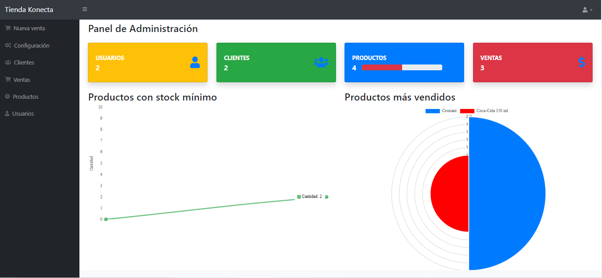

# Sistema tienda Konecta

link de descarga: https://github.com/rody216/tiendakonecta
## Requerimientos
* PHP 7.2
* MySQL 5.7

## Instalación
1.  Clonar el repositorio y ubicar la carpeta en la carpeta www de
    wamp o en htdocs de xampp
2.  Levantar el servidor de phpmyadmin y los servicios de mysql o Mariadb
3.  Crear una base de datos en MySQL de nombre konecta
4.  Importar el Script de la base de datos incluido en el repositorio de
    nombre `konecta_bd.sql`
5.  Configurar el archivo `conexion.php` con los datos de la base de datos
    $host = "localhost";
    $user = "root";
    $clave = "";
    $bd = "konecta";
    Si en su servidor local maneja contraseña colocarla en medio de las comillas de la variable $clave
6.  Abrir desde el navegador la Ruta `http://localhost/tiendakonecta/` , debido a 
    que el proyecto se ejecuta en un servidor local.
7.  Las Credenciales de Accesso son user: `admin` pass: `admin` para ingresar 
    con permisos de administrador, y user: `konecta` pass: `konecta` para ingresar como usuario con restricciones    
6.  Al ingresar al sistema, la pantalla de inicio le muestra los filtros 
    indicandole cuales son los productos mas vendidos, los productos con stock minimo, cuantos usuarios hay registrados, cuantos clientes, cuantos productos y cuantas ventas se han realizado.
7.  En la parte superior derecha se encuentra el boton de cerrar sesion y cambio
    de contraseña, el cual le permite cerrar la sesion y volver a la pantalla de login, o cambiar la contraseña del usuario que se encuentre logueado.
8.  En la parte superior izquierda se encuentra el boton de menu, el cual 
    le permite desplegar el menu de opciones del sistema.
9.  En la parte inferior izquierda se encuentra la información de       
    CopyRignt.
10. En la parte inferior derecha se encuentra las políticas de privacidad 
    los terminos y condiciones.

## Descripción General
1.  El Software tiene acceso de usuarios con permisos de usabilidad.
2.  La Contraseña Ingresada por el usuario esta encriptada y no se permite
    visualizar, ni en la base de datos ni en el formulario que carga los datos, para evitar cualquier tipo de intromision no deseada.
3.  Los usuarios se pueden crear libremente y los permisos de acceso se asigna
    posteriormente desde el panel de usuario.
4.  Los usuarios se pueden crear libremente y los permisos de acceso se asigna
    posteriormente desde el panel de usuario.
6.  Los archivos que se eliminan del sistema no se borran de la base de datos para
    evitar perdida de información, entran en un estado de inactividad donde se muestra pero no su estado es inactivo, que es como si no estuviera.
7.  El sistema utiliza una libreria ajax para maneter una comunicacion asincrona
    con el servidor, lo que permite que la pagina no se recargue y se mantenga la informacion en pantalla.
8.  Tambien utiliza Javascript para mantener una persistencia en la validacion de
    los formularios, evitando que se recargue la pagina y se pierda la informacion.
9.  El sistema utiliza una libreria fpdf para lograr la exportacion de las 
    facturas de php a pdf, para que el usuario pueda imprimir los reportes que desee.